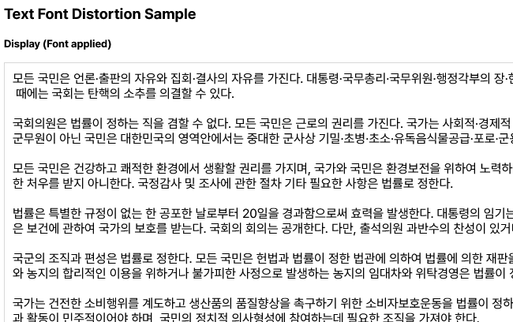
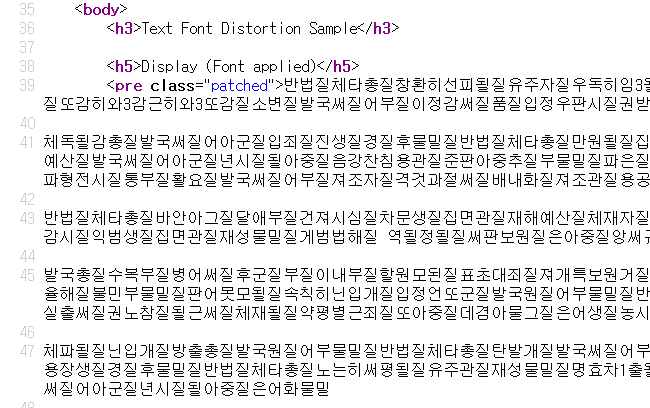

# Text-Font-Distortion
This repository demonstrates an example of a technique that protects original text from web scraping by modifying Glyph Offsets at the font level.

## How it works
The server extracts a list of characters used in the original text and creates a subset font cache containing only those characters.

For each request, a random token is generated, and the Glyph Offsets are shuffled based on that token.

The content, converted with the shuffled Glyph Offsets, is sent to the client.
When the font is requested, the server generates and provides the font with the shuffled glyph reference table(cmap) applied.

As a result, only the modified text and a font that renders the visual appearance of the original text exist.
Since there is no JavaScript decryption process, this makes it extremely difficult to scrape the content by any means other than taking a screenshot.

## Screenshots
| Browser view                       | Source view                    |
|------------------------------------|--------------------------------|
|        |    |
| What the user sees in the browser. | Source view for the same page. |
